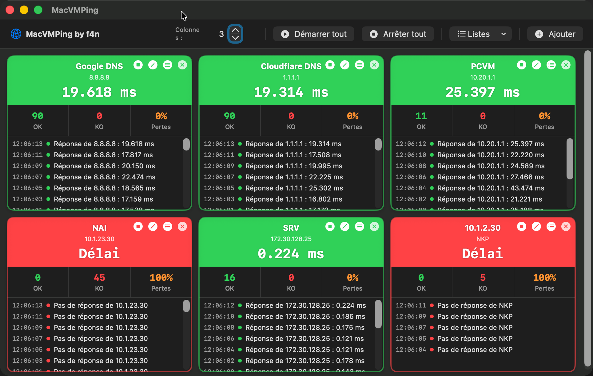

# 🖥️ MacVMPing by f4n

> Application macOS de monitoring réseau multi-hôtes, inspirée de VMping pour Windows.


---

## 📸 Aperçu

```

---

Panneaux colorés en temps réel, journal par hôte, notifications système et gestion de listes — tout ce qu'il faut pour surveiller votre réseau d'un coup d'œil.

| Couleur | Signification |
|---|---|
| 🟢 Vert | Hôte accessible |
| 🔴 Rouge | Hôte inaccessible |
| 🔵 Bleu | Ping en cours |
| 🟠 Orange | Erreur (nom invalide...) |
| ⚫ Gris | En attente |

---

## ✨ Fonctionnalités

### v1.1.0 — Nouveautés
- 📋 **Sauvegarde et chargement de listes d'hôtes** — Sauvegardez vos configurations réseau avec un nom et rechargez-les en un clic
- 📐 **Redimensionnement automatique** — La grille s'adapte automatiquement à la taille de la fenêtre
- ✏️ **Modification d'un hôte existant** — Modifiez l'IP ou le label sans supprimer et recréer l'hôte
- 📄 **Import de liste par fichier CSV** — Importez une liste d'hôtes en masse depuis un fichier `.csv`

### v1.0.0 — Fonctionnalités de base
- 🏓 **Ping ICMP multi-hôtes** en simultané avec latence en temps réel
- 📊 **Statistiques** par hôte : paquets OK, KO, % de perte
- 📜 **Journal** par hôte avec horodatage
- 🔔 **Notifications système** lors d'un changement d'état avec timestamp
- ➕ **Ajout / suppression** d'hôtes à la volée
- 🎛️ **Grille configurable** de 1 à 6 colonnes
- ▶️ **Démarrage automatique** du ping au lancement

---

## 📄 Format du fichier CSV

Pour importer une liste d'hôtes, créez un fichier `.csv` avec ce format :

```
hostname,label
8.8.8.8,Google DNS
1.1.1.1,Cloudflare DNS
192.168.1.1,Routeur local
mon-serveur.local,Serveur NAS
10.0.0.5,Bastion
```

> La première ligne (header) est ignorée automatiquement si elle commence par `host`.
> Le label est optionnel — si absent, l'hostname est utilisé comme label.

---

## 🚀 Installation

### Prérequis
- macOS 13 (Ventura) ou supérieur
- Xcode 15 ou supérieur (pour compiler)

### Depuis les sources

```bash
# Clonez le dépôt
git clone https://github.com/votre-compte/MacVMPing.git

# Ouvrez dans Xcode
open MacVMPing/MacVMPing.xcodeproj
```

1. Dans Xcode, allez dans **Signing & Capabilities** et supprimez **App Sandbox**
2. Compilez avec **Cmd+B**
3. Récupérez le `.app` dans **Product → Show Build Folder in Finder → Release**

### Distribution sans App Store

Copiez `MacVMPing.app` sur le Mac cible. Au premier lancement :
1. Double-cliquez sur l'app → message de sécurité macOS
2. **Préférences Système → Confidentialité et sécurité → Ouvrir quand même**

---

## 📁 Structure du projet

```
MacVMPing/
├── MacVMPingApp.swift      — Point d'entrée, permissions notifications
├── ContentView.swift       — Fenêtre principale, barre d'outils, grille
├── HostModel.swift         — Logique ping, détection changement d'état
├── HostProbeView.swift     — Panneau visuel d'un hôte
└── FavoritesList.swift     — Sauvegarde/chargement des listes, import CSV
```

---

## 🗺️ Roadmap

- [ ] Ping TCP sur port (host:port)
- [ ] Traceroute intégré
- [ ] Export des logs en CSV

---

## 📝 Changelog

### v1.1.0 — 2026
- Ajout : sauvegarde et chargement de listes d'hôtes (persistance sur disque)
- Ajout : redimensionnement automatique de la grille selon la fenêtre
- Ajout : modification d'un hôte existant (bouton ✏️ sur chaque panneau)
- Ajout : import de liste d'hôtes par fichier CSV
- Correction : avertissement `onChange` deprecation macOS 14

### v1.0.0 — 2026
- Version initiale
- Ping ICMP multi-hôtes avec code couleur
- Notifications système avec timestamp
- Journal par hôte
- Icône personnalisée ECG

---

## 👤 Auteur

**f4n** — Projet personnel, usage interne.  
Inspiré de [vmPing](https://github.com/r-smith/vmPing) par R. Smith (Windows).

---

*MacVMPing — Parce que surveiller son réseau doit être simple et visuel.*
